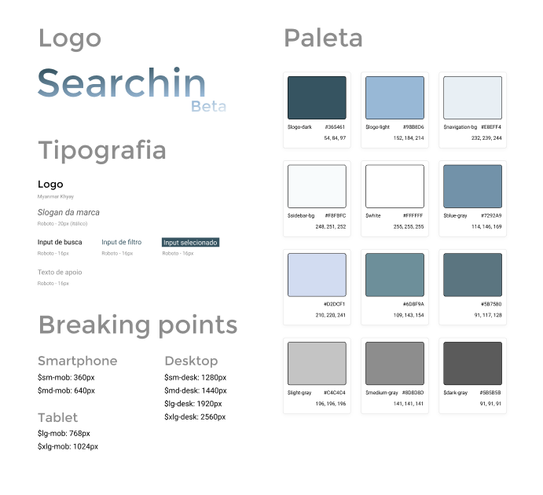
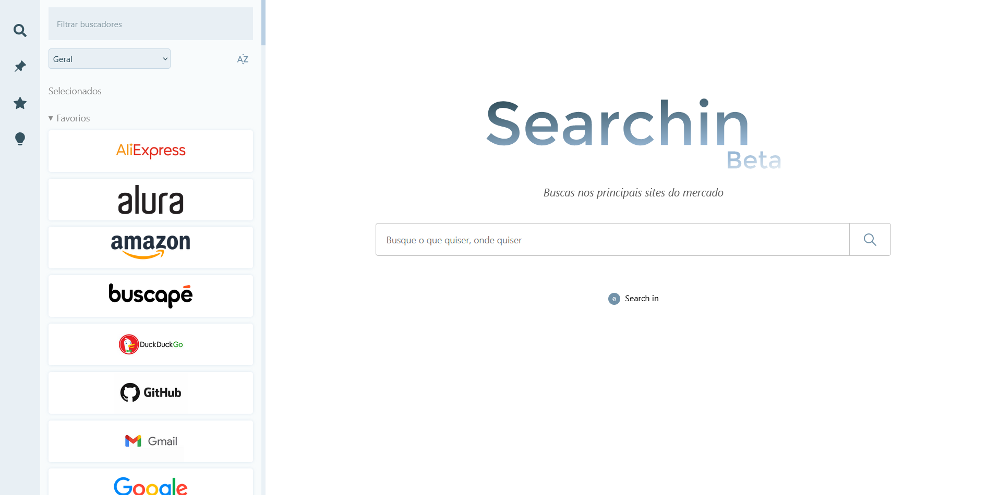

<h1 align="center">Searchin</h1>

## Sobre

O projeto se trata de uma Start Page com pretensão de vir a ser um buscador personalizável. Sua abordagem se trata da busca direta dentro de mecanismos de busca tradicionais, assim como dentro de buscadores imbutidos em websites famosos, como o Youtube, Amazon, Wikipedia e afins. Com o Searchin é possível não apenas realizar buscas internas nos wesites sem a necessidades de os acessar diretamente, mas também executar buscas avançadas, como a busca multipla, busca múltipla básica e a busca múltipla avançada.

---

## Tecnologias

<p align="left">
  
  
  
</p>

---

## Estrutura do Projeto

```bash
├───Modal
│   └───Sreens
├───Navigation
├───Search
│   └───Preview
└───Sidebar
    ├───Card
    ├───Default
    ├───Fixed
    └───Tips
```

**Modal**: Pode ser aberto ou fechado para exibir conteúdos adicionais. Todas as suas possíveis telas são configuradas dentro do diretório _Screens_.

**Navigation**: Esta é a barra de navegação que altera a visualização da sidebar. Pode estar na lateral na versão desktop ou no canto inferior na versão mobile.

**Search**: É o local onde são realizadas as buscas, contando principalmente com a logo, slogan e campos de input. Ainda, abaixo do input de busca existe um componente de pré-visualização das buscas que serão realizadas, chamado de _Preview_.

**Sidebar**: Se trata do sistema de gestão de seleção de websites, configuração de buscadores default e favoritos, além das dicas de utilização do sistema. Cada uma destas ferramentas é configurada dentro de seu próprio componente, como nos casos do _Default_, _Fixed_ e _Tips_. E exceção é a ferramenta inicial de seleçõ que websites, que está embutida na própria sidebar, e apenas os card de cada site são componentes próprios dentro do diretório _Card_.

---

## Modos de busca

- **Busca simples**: A busca simples se trata de uma querie única, que pode ser buscada por um ou mais websites suportados pelo Searchin. Para realizar a busca basta inserir a querie no input de buscas e selecionar os websites que devem ser utilizados. Desta forma, serão abertas novas abas, uma para cada website selecionado.
- **Busca múltipla básica**: Neste caso a querie inserida no inpur de busca é quebrada em diversas sub-queries. Desta forma, é possível realiza mais que um único valor dentro de cada buscador selecionado. Para realizar esta operação é necessário separar cada sub-querie através do operador "|" (pipe).
- **Busca múltipa avançada**: Por fim, a busca avançada se trata de uma estratégia de endereçamento de queries ou uma série de sub-queries para determinados websites. Esta distribuição é realizada de acordo com a ordem de seleção de cada website, tal como a disposição dos separadores dentro do input de busca. Esta operação pode ser realizada através do operador "^", e pode ser combinada com a busca múltipla básica.

---

## Próximos Passos

- [x] Dar suporte para o mobile através de um design responsivo
- [x] Criar as interfaces usadas pelos componentes da aplicação
- [x] Fazer uma limpeza nos dados retornados pelo mockAPI.json
- [ ] Verificar buscas que estão quebrando e realizar as correções
- [ ] Realizar melhorias de SEO, acessibilidade e performance
- [ ] Componentizar a visualização dos websites suportados na sidebar inicial
- [ ] Implementar o sistema de buscas através de shortcuts
- [ ] Permitir o reajuste de largura da sidebar
- [ ] Passar a estilização para a biblioteca Styled Components
- [ ] Realizar correções de performance no React (evitar re-renderização)
- [ ] Utilizar a biblioteca Redux para realizar a gestão de estados
- [ ] Desenvolver testes automatizados para assegurar as regras de negócio
- [ ] Aplicar um sistema de analytics para visualizar trafego
- [ ] Implementar tooltips para ajudar com o uso da barra de navegação
- [ ] Mecanismo de histórico de buscas e armazenamento de buscas padrão
- [ ] Criar uma API e um sistema back-end para armazenar os dados dos websites suportados

---

## Guia de Estilo



---

## Referência Visual


